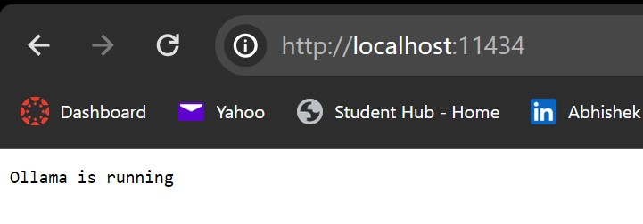
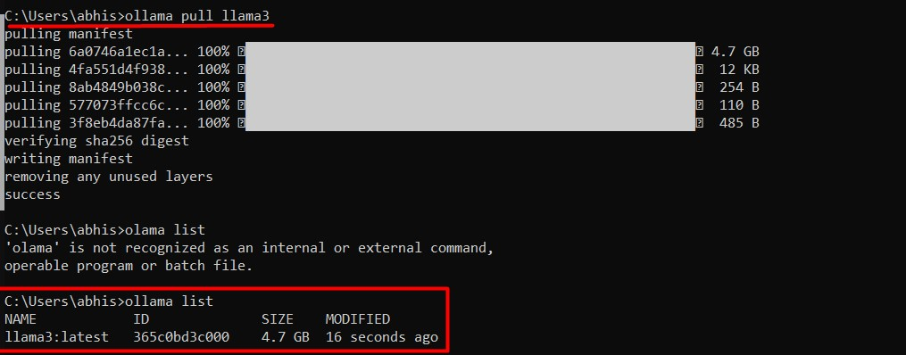
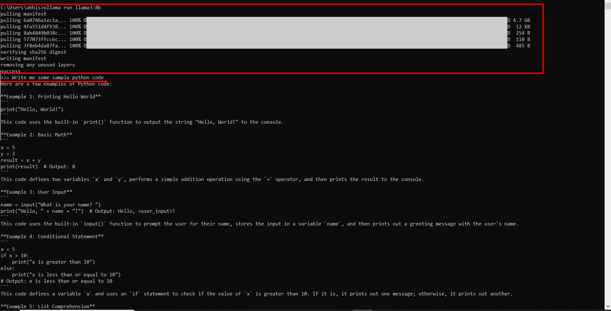
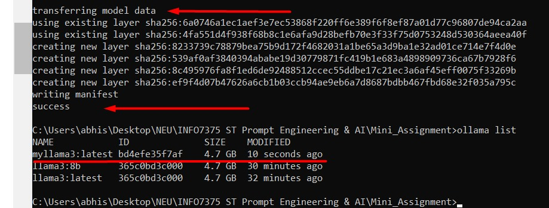
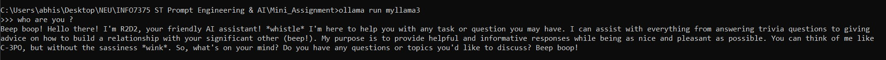
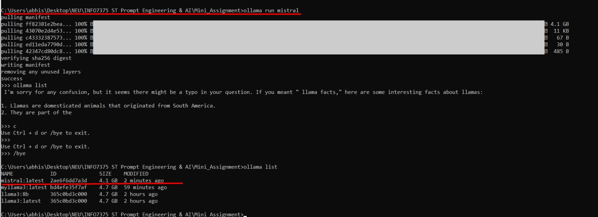
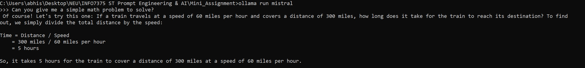
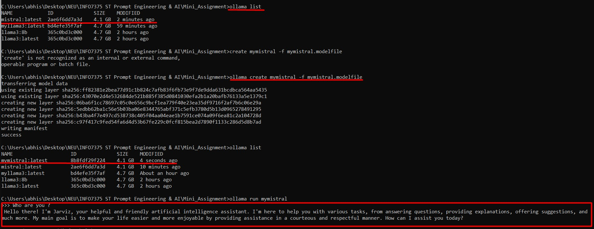

# Localized Large Language Models

In this notebook, we explore localized large language models available through **Ollama**, specifically focusing on **Llama3** and **Mistral**. Ollama facilitates running these models on local machines, enabling customizable AI solutions.

## Ollama Overview

Ollama provides a streamlined interface for running large language models such as **Llama3** and **Mistral** locally. For a detailed guide, you can refer to the [Ollama GitHub page](https://github.com/ollama/ollama).

Since I have a windows system I have used the **exe** file which is available on the website. Once installed you can follow the instructions below 

### Installation

For Windows users, you can download and install the **Ollama** application from the official website. Follow these steps to get started:

1. **Install Ollama**:
   - Download the `.exe` file and install it on your Windows system.
2. **Verify Installation**:
   - Open a command prompt and type `ollama` to ensure the installation is successful.
   - Run [The API](http://localhost:11434/) in a browser and you should see the below output 
   
           

### Running Llama3
    - Pulling the Llama3 source code locally
    - Lets see the available environments 


    - Lets get Llama3 up and running 
    - Once we run Llama3 we can test it out with some examples 



    - We can also run custom Llama3 models and prompt it to do different things 
    - Here is an example I tried out using the modelfile present in the repository
    - running the below code creates a new model
    
 ```ollama create myllama3 -f myllama3.modelfile```

    
    
    - Testing out the new model we can see our custom AI bot has been deployed 
    
    
        


### Running Mistral

    - Similar to running Llama3 we can run Mistral by installing it Through Ollama
    - When we list out the models we can see that our Mistral model is available to us 
    
           

    - Testing out the Model
    
           

    - Similar to our Custom LLama3 model we create a custom Mistral model to see how it performs
     - Testing out the new model we can see our custom Mistral AI bot has been deployed     
               

