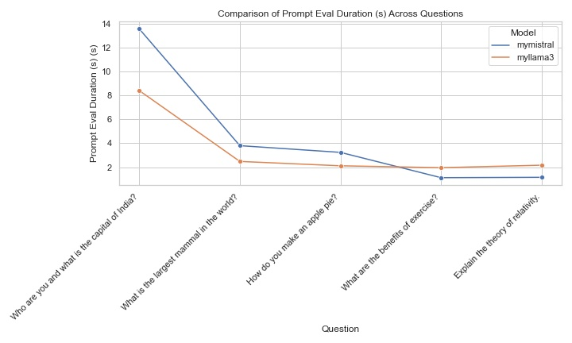

# Localized Large Language Models

In this notebook, we explore localized large language models available through **Ollama**, specifically focusing on **Llama3** and **Mistral**. Ollama facilitates running these models on local machines, enabling customizable AI solutions.

## Ollama Overview

Ollama provides a streamlined interface for running large language models such as **Llama3** and **Mistral** locally. For a detailed guide, you can refer to the [Ollama GitHub page](https://github.com/ollama/ollama).

Since I have a windows system I have used the **exe** file which is available on the website. Once installed you can follow the instructions below 

## Installation

For Windows users, you can download and install the **Ollama** application from the official website. Follow these steps to get started:

1. **Install Ollama**:
   - Download the `.exe` file and install it on your Windows system.
2. **Verify Installation**:
   - Open a command prompt and type `ollama` to ensure the installation is successful.
   - Run [The API](http://localhost:11434/) in a browser and you should see the below output 
   
         

## Using Ollama 

1. I have used Ollama to run the models using the following 2 methods 

    - `CURL commands` - I used CURL commands to test out both the models and compare them
    - `Command prompt` - This was used to interact with the models and to make the Q&A feature more intuitive and feel less programatic


### Steps to run Llama 3
    - Pulling the Llama3 source code locally
    - Lets see the available environments 


    - Lets get Llama3 up and running 
    - Once we run Llama3 we can test it out with some examples 


    - We can also run custom Llama3 models and prompt it to do different things 
    - The **myllama.modelfile** in this repo consists of the custom model. 
    - Here is an example I tried out using the modelfile present in the repository
    - running the below code creates a new model
    
 ```ollama create myllama3 -f myllama3.modelfile```

    
    
    - Testing out the new model we can see our custom AI bot has been deployed 
    
    
        


### Steps to run Mistral

    - Similar to running Llama3 we can run Mistral by installing it Through Ollama
    - When we list out the models we can see that our Mistral model is available to us 
    
           

    - Testing out the Model
    
           

     - Similar to our Custom LLama3 model we create a custom Mistral model to see how it performs
     - Testing out the new model we can see our custom Mistral AI bot has been deployed
     - The **mymistral.modelfile** in this repo consists of the custom model.           
               

## Comparing the Large Language Models

We can compare the large language models by passing using the Curl command and obtaining important information 

```
curl -X POST http://localhost:11434/api/generate -d "{\"model\": \"llama3\",  \"prompt\":\"Tell me a fact about Llama?\", \"stream\": false}"
```
we get the following parameters upon running the API 

- `total_duration`: time spent generating the response
- `load_duration`: time spent in nanoseconds loading the model
- `prompt_eval_count`: number of tokens in the prompt
- `prompt_eval_duration`: time spent in nanoseconds evaluating the prompt
- `eval_count`: number of tokens in the response
- `eval_duration`: time in nanoseconds spent generating the response
- `context`: an encoding of the conversation used in this response, this can be sent in the next request to keep a conversational memory
- `response`: empty if the response was streamed, if not streamed, this will contain the full response

Now I have created a custom script to run a set of questions and compare some of the parameters across the models

here are some of the outputs I got when comparing the following parameters 

- `prompt_eval_duration`: time spent in nanoseconds evaluating the prompt
- `eval_duration`: time in nanoseconds spent generating the response

           

             


    

### Conclusion and Performance Comparison

- Response Efficiency: myllama3 appears to be generally more efficient in responding to both simple and complex questions, suggesting it may be better optimized for quicker evaluations.

- Complex Query Handling: Both models show increased evaluation times for complex or multi-step queries, but myllama3 seems to handle these slightly more efficiently in terms of overall time.

- Initial Response Time: myllama3 demonstrates faster prompt evaluation, which could lead to quicker initial responses, making it potentially more responsive for interactive tasks.